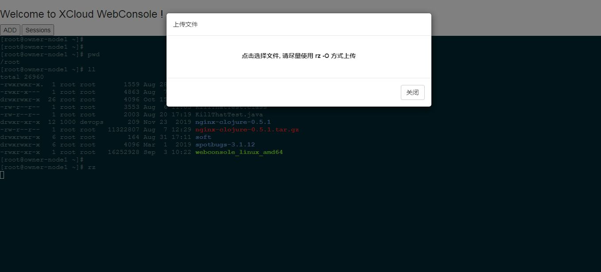
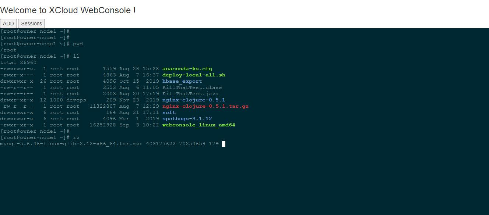

# XCloud WebConsole
A lightweight enterprise Web Console terminal, which brings together the advantages of most similar products, supporting SSH2/lrzsz (RDP/RFB/Telnet) protocol, Audit and screen recording function, etc

[中文文档](README_CN.md).

### Quick start

##### 1. Installing project
```
git clone https://github.com/wl4g/xcloud-webconsole.git # upstream, latest
# git clone https://gitee.com/wl4g/xcloud-webconsole.git
cd xcloud-webconsole/scripts
./build.sh  # Cross compiling to Windows
# build.bat # Cross compiling to Linux
```

##### 2. Deploying to nginx https. (Optional)
Because webconsole is based on HTML, the copy and paste functions of the browser are limited by the security mechanism and can only be used under HTTPS, Of course, if you don't want to be troublesome, this step can be ignored. You can use HTTP local test directly, but you can't use the copy and paste function of the browser


###### 2.1 Add hosts
```
127.0.0.1   webconsole.wl4g.debug
```

```
sudo mkdir -p /etc/nginx/conf.d && \
cat > /etc/nginx/conf.d/webconsole.conf <<EOF
# Generated by WebConsole docs sample.

# WebConsole Webapps pages.
server {
    listen 443;
    server_name webconsole.sunwuu.fat;
    ssl on;
    ssl_certificate   certs/_wildcard.wl4g.debug.pem;
    ssl_certificate_key  certs/_wildcard.wl4g.debug-key.pem;
    ssl_session_timeout 5m;
    ssl_ciphers ECDHE-RSA-AES128-GCM-SHA256:ECDHE:ECDH:AES:HIGH:!NULL:!aNULL:!MD5:!ADH:!RC4;
    ssl_protocols TLSv1 TLSv1.1 TLSv1.2;
    ssl_prefer_server_ciphers on;
    location / {
       root /usr/share/nginx/html/webconsole;
       index index.html;
    }
}

# WebConsole APIs.
server {
    listen 26088 ssl;
    server_name  webconsole.sunwuu.fat;
    ssl_certificate   certs/_wildcard.wl4g.debug.pem;
    ssl_certificate_key  certs/_wildcard.wl4g.debug-key.pem;
    ssl_session_timeout  5m;
    ssl_prefer_server_ciphers    on;
    ssl_protocols TLSv1 TLSv1.1 TLSv1.2;         
    ssl_ciphers ECDHE-RSA-AES128-GCM-SHA256:HIGH:!aNULL:!MD5:!RC4:!DHE;
    location / {
        proxy_http_version 1.1;    
        proxy_set_header Upgrade $http_upgrade;
        proxy_set_header Connection "upgrade";     
        proxy_set_header X-real-ip $remote_addr;
        proxy_set_header X-Forwarded-For $remote_addr;
        proxy_pass http://127.0.0.1:16088;
    }
}
EOF

sudo chmod 755 /etc/nginx/conf.d/webconsole.conf
sudo systemctl restart nginx
```

##### 2.2. Installing test CA certificate. (Optional, Follow step 2)
- Install the test CA certificate to the system and chrome.</br>
  for example (Chrome84.x): </br>
```
chrome://settings/security
```
Management Certificate -> Trusted certification authority -> Imports </br>
Then restart chrome and try to access: https://webconsole.wl4g.debug


### Features
- It is designed as a native JavaScript class library, which can be easily integrated with React/Vue/AngularJS and other frameworks
- It can run on `Android iOS` and any other terminal that can render HTML. It can almost completely replace the shell client based on the installation program
- Fully support `lrzsz` command set (implemented based on zmodem)
- Enhanced support for mobile terminal copy, paste, fast forward, backward and other key combination command, user-friendly operation habits
- Seamless docking Prometheus metric acquisition


### Collect prometheus metrics
```
curl http://localhost:16089/metrics

# HELP goroutines_num Number of goroutines
# TYPE goroutines_num gauge
goroutines_num 16
# HELP mysql_active_conn Current active connections of MySQL
# TYPE mysql_active_conn gauge
mysql_active_conn{dbconnectstr="gzsm:******@tcp(10.0.0.160:3306)/devops_dev?charset=utf8",host="10.0.0.172"} 1
# HELP ssh2_active_dispatch_channels Current active channels of SSH2 dispatcher
# TYPE ssh2_active_dispatch_channels gauge
ssh2_active_dispatch_channels{host="10.0.0.172",user="admin"} 0
# HELP threads_num Number of threads
# TYPE threads_num gauge
threads_num 8
# HELP virtual_free_memory Size of virtual free memory
# TYPE virtual_free_memory gauge
virtual_free_memory 1.731424256
# HELP virtual_total_memory Size of virtual total memory
# TYPE virtual_total_memory gauge
virtual_total_memory 8.50089984
```

### Screenshots
- 
- 

> Note: the page does not set the most compact test page of CSS style


### Primary Dependencies
- Logging framework [go.uber.org/zap](go.uber.org/zap)
- Widely used Web framework [github.com/gin-gonic/gin](github.com/gin-gonic/gin)
- Prometheus index monitoring and collection framework [github.com/prometheus](github.com/prometheus)
- Host index collection tool [github.com/shirou/gopsutil](github.com/shirou/gopsutil)
- High performance JSON serialization framework [github.com/json-iterator/go](github.com/json-iterator/go)
- Websocket framework [github.com/gorilla/websocket](github.com/gorilla/websocket)


### Other descriptions (Optional)
- [Generate temporary debug HTTPS SSL certificate](https://github.com/wl4g-collect/mkcert)


### TODO
- [√] Completely unify the daily output of each component, such as `gin` framework.
- [√] Enhance the administrator functions of webconsole service, such as its own health/metrics/indicator(CPU/Mem/Network/Connections...) And more detailed indicators.
- Canvas + Object Storage Audit screen recording function.
- In order to realize the remote image UI control protocol compatible with windows RDP(Remote Desktop Protocol) based on Web, And RFB/Telnet

### Custom Development Guide
- It is recommended that ide use vscode for secondary development, because the project root directory already contains the .vscode editor configuration file
- Modifying database configuration: resources/webconsole.yml#datasource.mysql.dbconnectstr
- Configuration file description: this project uses Viper configuration framework, and the loading priority is: Set()/Flags/Env/Config/Default
- If you need to add new configuration items, you must use config_ generator.go Tool generation and xxx-config.go Corresponding default configuration items to webconsole.default.yml.go, reference command:
```
cd $WEBCONSOLE_HOME
go run config_generator.go

Successfully for pkg/config/webconsole.default.yml.go
```