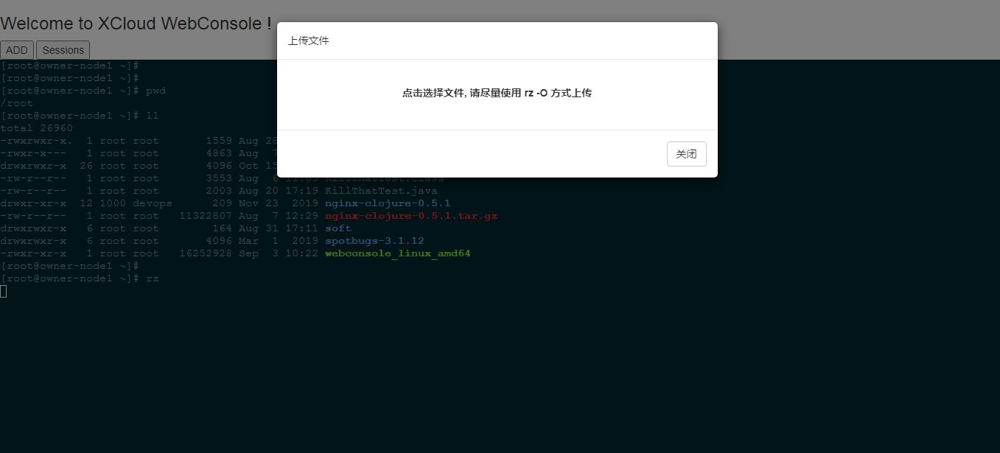

# XCloud WebConsole
一个轻量的企业级Web的控制终端程序，汇集了大多数同类产品优点于一身，支持SSH2、(RDP/RFB/Telnet)、审计和录屏等

English version goes [here](README.md).

### 快速开始

#### 1. 安装
```
git clone https://github.com/wl4g/xcloud-webconsole.git # 上游，最新
# git clone https://gitee.com/wl4g/xcloud-webconsole.git
cd xcloud-webconsole/scripts
./build.sh  # 交叉编译为Windows程序
# build.bat # 交叉编译为Linux程序
```

#### 2. 部署到nginx支持https. (可选)
因为webconsole是基于HTML的，浏览器的复制和粘贴功能受到安全机制的限制，只能在HTTPS下使用，当然若不想麻烦，也可忽略此步骤，直接使用HTTP本地测试，只是不能使用浏览器的复制和粘贴功能。

###### 2.1 添加hosts
```
127.0.0.1   webconsole.wl4g.debug
```

```
sudo mkdir -p /etc/nginx/conf.d && \
cat > /etc/nginx/conf.d/webconsole.conf <<EOF
# Generated by WebConsole docs sample.

# WebConsole Webapps pages.
server {
    listen 443;
    server_name webconsole.sunwuu.fat;
    ssl on;
    ssl_certificate   certs/_wildcard.wl4g.debug.pem;
    ssl_certificate_key  certs/_wildcard.wl4g.debug-key.pem;
    ssl_session_timeout 5m;
    ssl_ciphers ECDHE-RSA-AES128-GCM-SHA256:ECDHE:ECDH:AES:HIGH:!NULL:!aNULL:!MD5:!ADH:!RC4;
    ssl_protocols TLSv1 TLSv1.1 TLSv1.2;
    ssl_prefer_server_ciphers on;
    location / {
       root /usr/share/nginx/html/webconsole;
       index index.html;
    }
}

# WebConsole APIs.
server {
    listen 26088 ssl;
    server_name  webconsole.sunwuu.fat;
    ssl_certificate   certs/_wildcard.wl4g.debug.pem;
    ssl_certificate_key  certs/_wildcard.wl4g.debug-key.pem;
    ssl_session_timeout  5m;
    ssl_prefer_server_ciphers    on;
    ssl_protocols TLSv1 TLSv1.1 TLSv1.2;         
    ssl_ciphers ECDHE-RSA-AES128-GCM-SHA256:HIGH:!aNULL:!MD5:!RC4:!DHE;
    location / {
        proxy_http_version 1.1;    
        proxy_set_header Upgrade $http_upgrade;
        proxy_set_header Connection "upgrade";     
        proxy_set_header X-real-ip $remote_addr;
        proxy_set_header X-Forwarded-For $remote_addr;
        proxy_pass http://127.0.0.1:16088;
    }
}
EOF

sudo chmod 755 /etc/nginx/conf.d/webconsole.conf
sudo systemctl restart nginx
```

###### 2.2. 安装测试CA跟证书 (可选, 跟随步骤2)
- 将CA跟证书安装到系统及chrome，使其受信任.</br>
例如在Chrome84.x中: </br>
```
chrome://settings/security
```
管理证书 -> 受信任的根证书颁发机构 -> 导入 </br>
然后重启chrome浏览器尝试访问: https://webconsole.wl4g.debug


### 度量及指标
```
curl http://localhost:16089/metrics

# HELP goroutines_num Number of goroutines
# TYPE goroutines_num gauge
goroutines_num 16
# HELP mysql_active_conn Current active connections of MySQL
# TYPE mysql_active_conn gauge
mysql_active_conn{dbconnectstr="gzsm:******@tcp(10.0.0.160:3306)/devops_dev?charset=utf8",host="10.0.0.172"} 1
# HELP ssh2_active_dispatch_channels Current active channels of SSH2 dispatcher
# TYPE ssh2_active_dispatch_channels gauge
ssh2_active_dispatch_channels{host="10.0.0.172",user="admin"} 0
# HELP threads_num Number of threads
# TYPE threads_num gauge
threads_num 8
# HELP virtual_free_memory Size of virtual free memory
# TYPE virtual_free_memory gauge
virtual_free_memory 1.731424256
# HELP virtual_total_memory Size of virtual total memory
# TYPE virtual_total_memory gauge
virtual_total_memory 8.50089984
```

### 运行环境
- 客户端建议使用 Chrome 40+、Firefox 38+、Safari 9+
- 二次开发建议基于 Golang 1.13+ 构建
- 本程序只能对 Unix/Linux 类的操作系统的 SSH 协议的 OS 远程操作（Windows RDP支持需参考具体发行版是否有RDP实现）


### 运行截图
- 
- 

> 说明：界面未设置css样式的最精简测试页面


### 特性
- 它被设计成一个原生JavaScript类库，可以很容易地与React/Vue/AngularJS和其他框架集成
- 它可以运行在Android/IOS和任何其他可以呈现HTML的终端上。它几乎可以完全取代基于安装程序的shell客户端
- 完全支持lrzsz命令集（基于zmodem实现）
- 增强了对移动终端的复制、粘贴、快进、后退等按键组合命令的支持，用户友好的操作习惯
- 无缝对接 prometheus 度量采集


### 主要依赖项目
- 日志框架 [go.uber.org/zap](go.uber.org/zap)
- 通用web框架 [github.com/gin-gonic/gin](github.com/gin-gonic/gin)
- 普罗米修斯 [github.com/prometheus](github.com/prometheus)
- 主机指标采集 [github.com/shirou/gopsutil](github.com/shirou/gopsutil)
- JSON序列化 [github.com/json-iterator/go](github.com/json-iterator/go)
- Websocket处理 [github.com/gorilla/websocket](github.com/gorilla/websocket)

### 其他说明（如果需要）
- [生成临时调试https SSL证书](https://github.com/wl4g-collect/mkcert)


### 待办清单

- [√] 完全统一每个组件的日常输出，如“gin”框架。
- [√] 增强webconsole服务的管理员功能，例如自身的health/metrics/indicator（CPU/Mem/Network/Connections…）和更详细的指示器
- canvas + coss 审计录屏功能
- 为了实现与windows RDP（远程桌面协议）兼容的基于Web的远程图像UI控制协议, 以及RFB/Telnet等